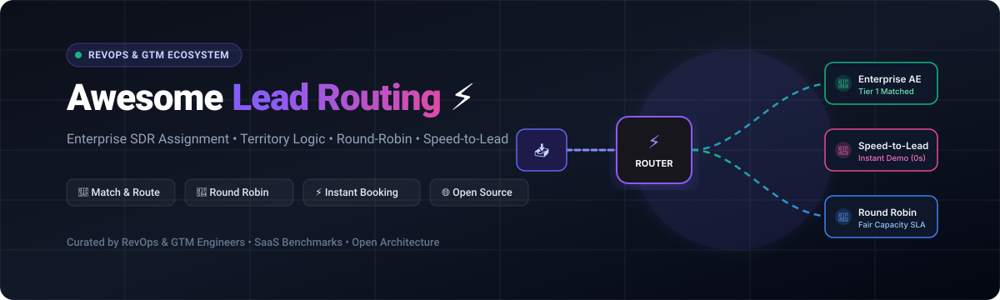
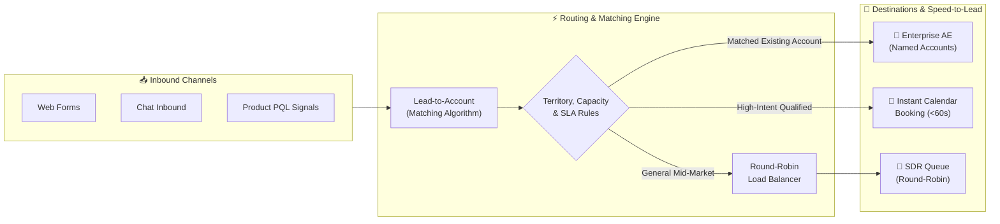

# ⚡ Awesome Lead Routing & RevOps Orchestration ⚡

     

**A curated index of top SaaS platforms, open-source repositories, algorithms, and architectural patterns for automated Lead Routing, Lead-to-Account (L2A) Matching, Round-Robin Distribution, Territory Management, Speed-to-Lead, and Meeting Scheduling.**

---

## 📌 Table of Contents
- [📖 Overview & Key Concepts](#-overview--key-concepts)
- [🏢 SaaS & Hosted Platforms](#-saashosted-platforms)
- [🌐 Open-Source GitHub Projects](#-open-source-github-projects)
- [🏗️ Architectural Patterns & Best Practices](#️-architectural-patterns--best-practices)
- [📈 Star History](#-star-history)
- [🤝 How to Contribute](#-how-to-contribute)
- [⚖️ Disclaimer](#-disclaimer)

---

## 📖 Overview & Key Concepts

**Lead Routing** is the backbone of modern Revenue Operations (RevOps) and Go-To-Market (GTM) engineering. An effective routing system ingests inbound prospect signals, resolves entity identity (matching contacts/leads to parent accounts), evaluates complex business rules (territory boundaries, rep capacity, account tiers, SLAs), and instantly dispatches the lead to the best sales or customer success representative.

### 🔑 Key Routing Capabilities:
- 🎯 **Lead-to-Account (L2A) Matching**: Fuzzy matching, domain resolution, and hierarchy traversal to attach new leads to existing CRM accounts.
- 🔄 **Round-Robin & Weighted Distribution**: Load-balanced allocation factoring in rep working hours, PTO, skill tags, and active lead quotas.
- 🗺️ **Territory & Tier Routing**: Dynamic segmentation based on geographic boundaries, firmographics (employee count, ARR), and named accounts.
- ⚡ **Speed-to-Lead & Instant Scheduling**: Form-to-calendar concierge booking that bridges web forms with qualified rep calendars in seconds (<60s SLA).
- 🛡️ **Fairness & SLA Governance**: Automated re-routing of stalled leads, fallback queues, and comprehensive audit logging.

---

## 🏢 SaaS/Hosted Platforms

> 📊 **Market Overview & Sector Structure**: The global Lead Routing, Scheduling, and RevOps Orchestration software market is estimated at **$4.2 Billion (projected to surpass $8.5 Billion by 2030 at a ~15.2% CAGR)**. The industry is **moderately fragmented**: enterprise Salesforce-native orchestration platforms (LeanData, Fullcast) compete alongside high-velocity meeting scheduling suites (Calendly, Chili Piper, RevenueHero) and flexible data iPaaS automation engines (Tray.ai), preventing a single winner-take-all outcome while sustaining high-margin specialized category leaders.

*The table below is sorted in descending order by **Company Scale (Valuation / Revenue)**.*

| Product | Company Scale (Valuation / Revenue) | Description | Pricing | Free Tier / Free Trial Limits |
| :--- | :--- | :--- | :--- | :--- |
| **[Calendly Routing](https://calendly.com/)** | 🦄 **$3.0B Valuation** 📊 ~$276M ARR | Inbound scheduling platform with routing forms, qualification filters, and multi-member booking assignment logic. | Teams plan starts at **$16/seat/month** (billed annually) or **$20/seat/month** (monthly) for routing and round-robin features | **Free Forever plan** available (limited to 1 connected calendar, 1 active event type, no team routing); **14-day free trial** for paid Teams features |
| **[Chili Piper](https://www.chilipiper.com/)** | 🦄 **$625M Valuation** 📊 ~$43M ARR | Inbound conversion & scheduling engine featuring Form Concierge for instant meetings and Distro for CRM record distribution. | Core Routing & Scheduling starts at **$1,250/month** ($15,000/year billed annually; includes 15 user seats; extra seats at $45/user/month) | **No free tier or self-serve trial**; live interactive product demo required |
| **[Tray.io (Tray.ai)](https://tray.ai/)** | 🚀 **$600M Valuation** 📊 ~$71M ARR | Enterprise integration and automation platform (iPaaS) used for complex multi-system lead routing, deduplication, and AI data enrichment. | Pro tier starts at **~$595–$1,000/month** (includes 3 workspaces and task quotas; scales with monthly consumption volume) | **14-day free trial** (managed trial with standard rate limits of 30 req/sec and 1,000 active connector calls; sales-assisted setup) |
| **[LeanData](https://www.leandata.com/)** | 🚀 **$450M Valuation** 📊 ~$22.1M ARR | Category-leading Salesforce-native GTM orchestration engine with visual drag-and-drop routing flows, L2A matching, and multi-object logic. | Starts at **~$39–$45/user/month** (annual contract minimums typically range between **$15,000–$25,000/year** based on objects and tiers) | **No free tier or trial**; vendor guided enterprise demo only |
| **[Fullcast](https://www.fullcast.com/)** | 💼 **~$100M+ Scale** 📊 ~$101.2M ARR | End-to-end revenue operations and GTM planning platform combining territory design, quota management, and real-time routing. | Custom enterprise plans starting at **~$15,000–$25,000/year** (scaled based on modular components like Plan, Pay, Performance and seat tiers) | **No free tier or self-serve trial**; live enterprise proof-of-concept / demo required |
| **[Openprise](https://www.openprise.com/)** | 📈 **~$42M Raised** 📊 ~$4.3M ARR | Full-stack RevOps data automation platform offering lead deduplication, continuous data enrichment, and cross-CRM routing pipelines. | Professional plan starts at **$35,000/year** (~$2,917/month billed annually; includes unlimited user seats and 400+ pre-built connectors) | **No free tier or trial**; custom enterprise demo and architecture review only |
| **[MadKudu](https://www.madkudu.com/)** | 📈 **~$29.1M Raised** 📊 ~$5.8M ARR | Predictive lead scoring, behavioral qualification, and signal-based routing platform for marketing and sales pipeline optimization. | Growth plan starts at **$1,999/month** (covers up to 2,000 scored leads/month; Pro plan starts at $2,499/month for up to 6,000 leads) | **No free tier or trial**; live consultation and guided evaluation required |
| **[RevenueHero](https://www.revenuehero.io/)** | ⚡ **~$11M Raised** 📊 ~$4.2M ARR | Modern inbound meeting scheduler and lead router designed for B2B mid-market teams with instant CRM reassignment and round-robin rules. | Outbound Essentials starts at **$20–$25/user/month**; Inbound Essentials starts at **$25/user/month + $79/month platform fee** (admin seats free) | **14-day free trial** (commitment-free, no credit card required; full access to qualification and form routing) |
| **[Distribution Engine](https://www.ncsquared.com/)** | 👥 **Employee-Owned (EOT)** 📊 ~$2.3M ARR | Highly-rated 100% native Salesforce lead, case, and opportunity assignment engine with sophisticated load-balancing and SLA monitors. | Starter tier starts at **$20/user/month** (5 license minimum, billed annually); Advanced tier at **$35/user/month**; Unlimited at **$55/user/month** | **30-day free trial** on Salesforce AppExchange (full-featured sandbox/production test; requires Salesforce Enterprise Edition+) |
| **[Gradient Works](https://www.gradient.works/)** | 🌱 **~$2M Raised** 📊 ~$1.8M ARR | Dynamic book management and Salesforce Flow-native lead routing platform facilitating continuous territory rebalancing. | Growth tier starts at **$799/month** (billed annually at ~$9,588/year; includes up to 10 rep users and dynamic accounts) | **Free Forever plan** available for Carve territory planner (includes account scoring and book management with usage limits; no credit card required) |

---

## 🌐 Open-Source GitHub Projects

*The open-source ecosystem provides building blocks for self-hosted workflow automation, scheduling, customer data platforms (CDP), and CRM assignment engines. Repositories are sorted in descending order by **GitHub Star Count**.*

| Project | GitHub Stars Badge | Description & Routing Capabilities |
| :--- | :---: | :--- |
| **[n8n](https://github.com/n8n-io/n8n)** |  | Fair-code workflow automation platform with native nodes for CRM API mutations, custom JavaScript round-robin logic, webhook listeners, and lead enrichment. |
| **[Twenty](https://github.com/twentyhq/twenty)** |  | Modern open-source CRM alternative to Salesforce with fully extensible GraphQL/REST APIs, custom object assignment, and visual pipeline management. |
| **[Odoo](https://github.com/odoo/odoo)** |  | Comprehensive open-source ERP & CRM suite with built-in rule-based lead assignment, territory distribution, and automated sales team round-robin. |
| **[Huginn](https://github.com/huginn/huginn)** |  | Open-source agent system for building automated event-driven pipelines that monitor web forms, scrape enrichment data, and route sales leads. |
| **[Cal.com](https://github.com/calcom/cal.com)** |  | Enterprise-grade open-source scheduling infrastructure with form-based qualification routing, round-robin team distribution, and CRM calendar synchronization. |
| **[Novu](https://github.com/novuhq/novu)** |  | Open-source notification infrastructure enabling sub-minute speed-to-lead alerts across Slack, Teams, Email, SMS, and push channels upon lead assignment. |
| **[PostHog](https://github.com/PostHog/posthog)** |  | Open-source product analytics & CDP suite for tracking user activity, calculating Product-Qualified Lead (PQL) scores, and emitting real-time routing webhooks. |
| **[ERPNext](https://github.com/frappe/erpnext)** |  | Open-source CRM and enterprise management system featuring rule-based lead assignment, sales territory tree hierarchies, and team quota balancing. |
| **[Chatwoot](https://github.com/chatwoot/chatwoot)** |  | Open-source omni-channel customer communication platform with automated agent routing, round-robin conversation allocation, and SLA compliance tracking. |
| **[Activepieces](https://github.com/activepieces/activepieces)** |  | No-code open-source automation engine with community pieces for HubSpot, Salesforce, Airtable, and Webhook distribution logic. |
| **[Airbyte](https://github.com/airbytehq/airbyte)** |  | Open-source ELT data integration tool for synchronizing raw lead records and event activity into data warehouses for batch scoring and routing models. |
| **[Formbricks](https://github.com/formbricks/formbricks)** |  | Open-source survey & form qualification suite that collects inbound intent signals, validates lead criteria, and triggers routing webhooks. |
| **[Mautic](https://github.com/mautic/mautic)** |  | Open-source marketing automation platform supporting behavioral scoring, campaign drip workflows, and automated stage-based CRM handoff routing. |

---

## 🏗️ Architectural Patterns & Best Practices

### 💡 Core Architectural Recommendations:
1. ⚡ **Optimize for Speed-to-Lead (<5 Minutes)**: Fast lead qualification and routing drastically boost demo conversion rates. Integrate instant scheduling on high-intent forms.
2. 🔄 **Handle Race Conditions with Idempotency**: When ingesting webhooks from multiple landing pages, use distributed locks or atomic CRM updates to avoid duplicate assignments.
3. 📊 **Maintain an Immutable Assignment Audit Trail**: Always write an audit record with every routing decision (e.g. matched rule ID, rep capacity at assignment time, timestamp) to simplify RevOps debugging and dispute resolution.
4. ⏸️ **Account for Rep Availability**: Synchronize routing pools with Google Calendar / Outlook to dynamically skip reps who are out-of-office (OOO) or at maximum active capacity.

---

## 📈 Star History

---

## 🤝 How to Contribute
1. 🍴 Fork the repository.
2. 📝 Add or update entries in `README.md` (keep descriptions concise, objective, and verified).
3. 🔍 Ensure all product links, pricing data, and open-source GitHub star badges are accurate.
4. 🚀 Submit a Pull Request with a short summary of the updates!

⭐ **Star this repository** if you find it helpful for your RevOps & GTM infrastructure!

---

## ⚖️ Disclaimer
- This curated repository is maintained by the community for informational and educational purposes — it does not constitute formal commercial RevOps advice.
- Lead assignment logic directly influences revenue velocity, sales compensation, and pipeline governance. Always validate routing rules in CRM sandboxes before production deployment.

---

  Made with ❤️ for RevOps leaders, Sales Ops architects, and GTM Engineers worldwide.

